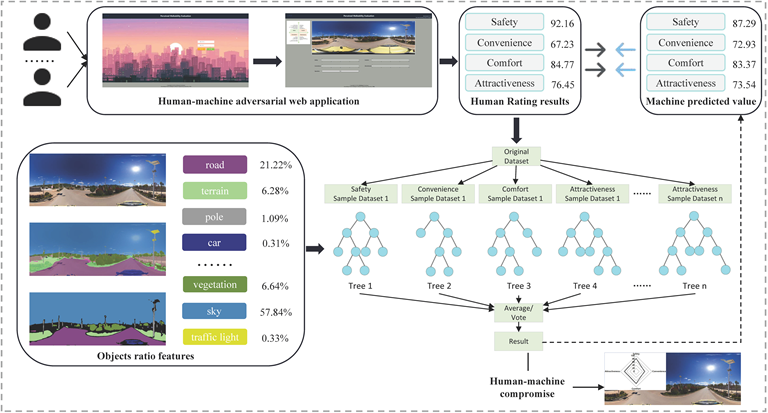

# Human-machine-adversarial-aid-evaluation
Reference：An Estimation Method for Multidimensional Urban Street Walkability Based on Panoramic Semantic Segmentation and Domain Adaptation

# About
Human-machine-adversarial-Web-Application was developed using Java/Weka/MySQL/spring+springmvc+myBatis by idea. It can directly run on Windows and Linux operating systems.
