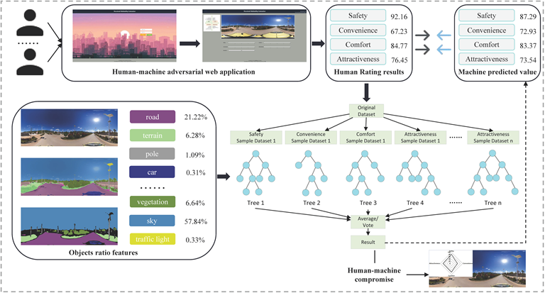

# Human-machine-adversarial-aid-evaluation
Reference：Li J, Zhang X, Li L, et al. An estimation method for multidimensional urban street walkability based on panoramic semantic segmentation and domain adaptation[J]. Engineering Applications of Artificial Intelligence, 2024, 136: 108905.

# About
Human-machine-adversarial-Web-Application was developed using Java/Weka/MySQL/spring+springmvc+myBatis by idea. It can directly run on Windows and Linux operating systems.
